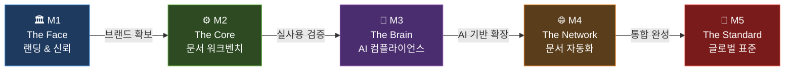

# 🏥 med.pikkto — 의료기기 ISO 및 인허가 지능형 엔터프라이즈 솔루션 로드맵

> **"인허가는 med.pikkto로 통한다"**
>
> 본 문서는 med.pikkto의 탄생부터 글로벌 의료기기 규제 시장 선점까지의 **5단계 마일스톤**을 정의합니다.

---

## 📋 목차

| #   | 마일스톤                     | 코드네임         | 핵심 키워드                          |
| --- | ---------------------------- | ---------------- | ------------------------------------ |
| 1   | 랜딩 페이지 & 신뢰 구축     | **The Face**     | 브랜드 이미지, 리드 확보             |
| 2   | MVP — 문서 워크벤치         | **The Core**     | Workbench, Smart Paste, 블록 편집, Audit Trail |
| 3   | AI 컴플라이언스 에이전트     | **The Brain**    | ISO RAG, 실시간 가드, 준수율 스코어  |
| 4   | 문서 관리 자동화 & 통합      | **The Network**  | RTM 자동 생성, DHF 동기화, Export    |
| 5   | 엔터프라이즈 에코시스템      | **The Standard** | CSV, QMS API, 글로벌 규제 패키지     |

---

## Milestone 1 · The Face

### 🎯 목표

지멘스(Siemens) / 스트라우만(Straumann) 급의 **전문적 브랜드 이미지 구축** 및 잠재 고객(Lead) 확보.

### 핵심 결과물

| #   | 결과물                                               | 상세 설명                                                                 |
| --- | ---------------------------------------------------- | ------------------------------------------------------------------------- |
| 1   | **하이엔드 원페이지 랜딩**                           | 산업용 하이엔드 디자인이 적용된 원페이지 랜딩 페이지                      |
| 2   | **검색 & 템플릿 탐색 UI**                            | "무엇을 인허가하시겠습니까?" 검색 및 템플릿 탐색 인터페이스               |
| 3   | **뉴스레터 구독 & 데모 신청 폼**                     | 전문가용 뉴스레터 구독 및 데모 신청 폼                                    |

### 💡 비즈니스 가치

> **"의료기기 인허가에 최적화된 전문 플랫폼이다"** 라는 시장의 **첫인상 선점**.

---

## Milestone 2 · The Core

### 🎯 목표

제조사 실무자의 **가장 큰 고통(HWP/Word 복합 표)** 을 해결하고, 의료기기 ISO/RA 문서를 실제로 운영할 수 있는 **문서 워크벤치 MVP**를 구축한다.

M2의 구현 단위는 단일 문서 편집기가 아니라, 문서 트리, 중앙 편집기, 검토 패널, 감사 추적을 결합한 **의료기기 규제 문서 워크벤치**다. 아래 3개 결과물이 결합되어 하나의 Workbench MVP를 구성한다.

### 핵심 결과물

| #   | 결과물                        | 상세 설명                                                                                    |
| --- | ----------------------------- | -------------------------------------------------------------------------------------------- |
| 1   | **Smart Paste Engine**        | 한글(HWP) / 워드(Word) 표를 붙여넣으면 깨지지 않고 **표준 양식으로 자동 변환**되는 Workbench 입력 엔진 |
| 2   | **Block-based Editor**        | VS Code형 Workbench 쉘 안에서 동작하는 노션(Notion) 스타일의 의료기기 전용 블록 편집 시스템 |
| 3   | **Audit Trail 기초**          | 누가, 언제, 왜 수정했는지 기록하는 **기본 로그(변경 이력) 시스템**과 Workbench 검토 패널의 기반 |

### 💡 비즈니스 가치

> **"이 워크벤치로 옮기면 노가다가 사라진다"** 는 확신 제공.

---

## Milestone 3 · The Brain

### 🎯 목표

**ISO 13485 / 14971** 규격을 실시간으로 감시하는 **지능(AI) 탑재**.

### 핵심 결과물

| #   | 결과물                        | 상세 설명                                                                                    |
| --- | ----------------------------- | -------------------------------------------------------------------------------------------- |
| 1   | **ISO RAG Engine**            | 최신 규격과 식약처 보완 사례를 학습한 **AI 에이전트** (Retrieval-Augmented Generation)        |
| 2   | **Real-time Guard**           | 작성 중인 문구의 **규격 부적합성 실시간 하이라이트** 및 수정 제안                             |
| 3   | **Compliance Score**          | 문서별 **규격 준수율 수치화** 대시보드                                                       |

### 💡 비즈니스 가치

> **"전문가 없이도 보완 없는 서류를 쓴다"** 는 비용 절감 효과.

---

## Milestone 4 · The Network

### 🎯 목표

파편화된 문서들을 **하나의 데이터 그물망**으로 연결.

### 핵심 결과물

| #   | 결과물                                    | 상세 설명                                                                                    |
| --- | ----------------------------------------- | -------------------------------------------------------------------------------------------- |
| 1   | **Traceability Matrix (RTM) 자동 생성**   | 요구사항 ↔ 위험 ↔ 검증 간의 **연결성 시각화** 및 자동 매핑                                   |
| 2   | **Global Sync**                           | 제품 사양 수정 시 전사적 문서(DHF 세트) **동시 업데이트**                                     |
| 3   | **Export Center**                         | FDA eSTAR(XML/JSON) 및 식약처 전자 보고용 파일 **원클릭 추출**                               |

### 💡 비즈니스 가치

> **"관리 부실로 인한 허가 취소 리스크"** 를 **제로(0)화**.

---

## Milestone 5 · The Standard

### 🎯 목표

**글로벌 표준 플랫폼 등극** 및 법적 공신력 완성.

### 핵심 결과물

| #   | 결과물                          | 상세 설명                                                                                    |
| --- | ------------------------------- | -------------------------------------------------------------------------------------------- |
| 1   | **Full CSV Package**            | 시스템 자체의 **소프트웨어 밸리데이션(CSV) 보고서** 자동 생성                                 |
| 2   | **Cloud QMS 연동 API**         | 기존 기업용 ERP / QMS 시스템과의 **데이터 연동** 인터페이스                                   |
| 3   | **Multi-National Support**      | CE MDR 🇪🇺, FDA 🇺🇸, PMDA 🇯🇵 등 **국가별 규제 패키지 확장**                               |

### 💡 비즈니스 가치

> **"인허가는 med.pikkto로 통한다"** 는 **업계 표준 등극**.

---

## 🗺️ 마일스톤 진행 흐름

---

## 📌 핵심 가치 요약

| 단계 | 시장 메시지                                         | 대상 고객          |
| ---- | --------------------------------------------------- | ------------------ |
| M1   | "의료기기 인허가에 최적화된 전문 플랫폼이다"        | 잠재 리드          |
| M2   | "이 툴로 옮기면 노가다가 사라진다"                  | 제조사 실무자      |
| M3   | "전문가 없이도 보완 없는 서류를 쓴다"               | RA/QA 담당자       |
| M4   | "관리 부실 리스크를 제로(0)화"                      | 품질 관리 부서     |
| M5   | "인허가는 med.pikkto로 통한다"                      | 엔터프라이즈 전체  |

---

> 📅 **문서 작성일**: 2026-03-26
>
> 📎 **프로젝트**: med.pikkto — ISO 특화 인허가 자동화 플랫폼
